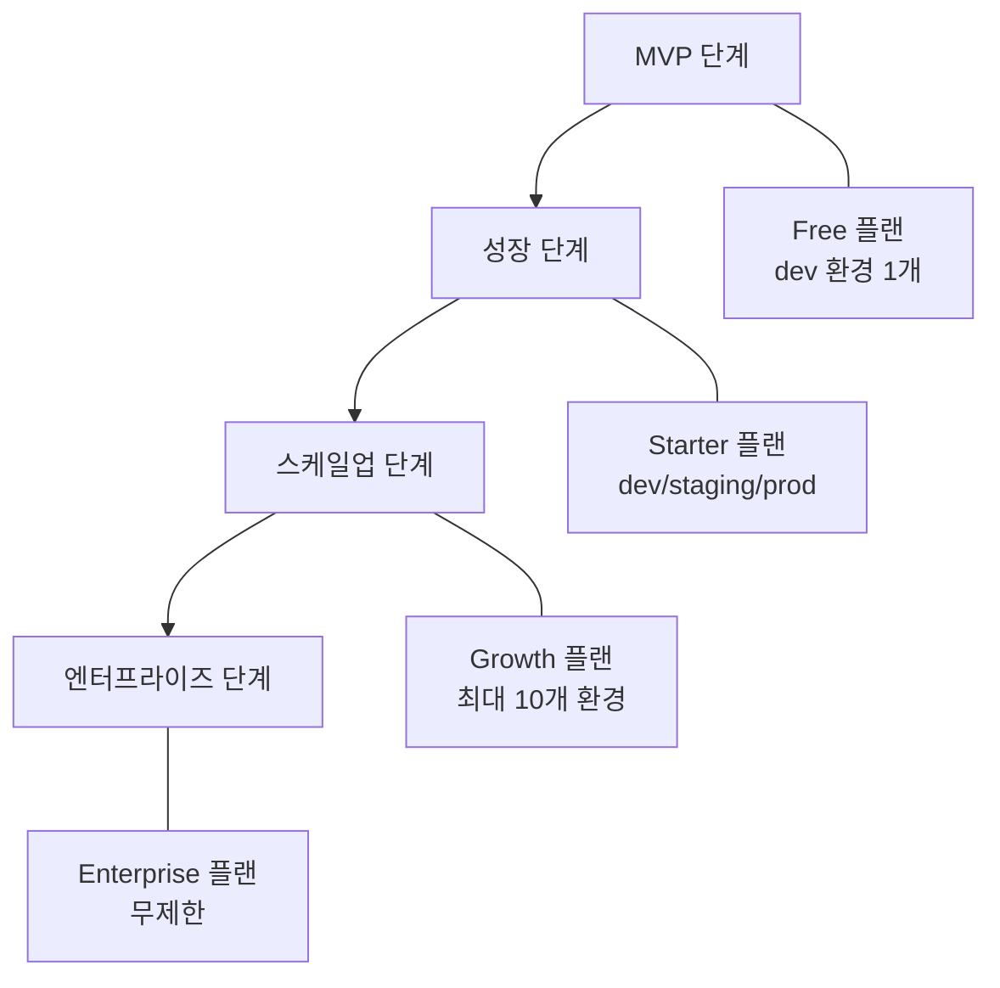
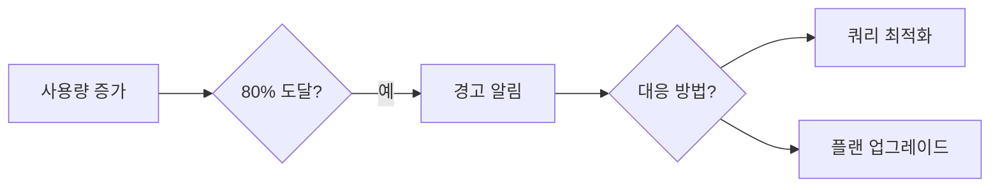

# 스케일링 가이드

> 서비스 성장에 따라 bkend 프로젝트를 확장하는 방법을 안내합니다.

## 개요

bkend는 플랜 업그레이드와 환경 분리를 통해 서비스를 확장할 수 있습니다. 트래픽 증가에 따른 단계별 확장 전략을 안내합니다.

---

## 확장 단계

---

## MVP 단계 (Free)

프로토타입과 초기 개발에 적합합니다.

| 항목 | 제한 |
|------|------|
| 환경 | dev 1개 |
| API 호출 | 10,000/월 |
| 저장소 | 1 GB |
| MAU | 1,000 |

### 이 단계에서의 권장사항

- 핵심 기능 검증에 집중하세요.
- 인덱스를 미리 설계하여 추후 성능 문제를 방지하세요.
- 데이터 모델을 확정하세요.

---

## 성장 단계 (Starter)

실제 서비스 출시와 초기 사용자 확보 단계입니다.

| 항목 | 제한 |
|------|------|
| 환경 | 3개 (dev/staging/prod) |
| API 호출 | 100,000/월 |
| 저장소 | 10 GB |
| MAU | 10,000 |

### 이 단계에서의 권장사항

- dev → staging → prod 배포 워크플로우를 수립하세요.
- staging에서 충분히 테스트한 후 prod에 반영하세요.
- 모니터링 대시보드를 정기적으로 확인하세요.
- API 호출 패턴을 분석하여 최적화하세요.

---

## 스케일업 단계 (Growth)

사용자가 빠르게 증가하는 단계입니다.

| 항목 | 제한 |
|------|------|
| 환경 | 최대 10개 (custom 포함) |
| API 호출 | 1,000,000/월 |
| 저장소 | 100 GB |
| MAU | 100,000 |

### 이 단계에서의 권장사항

- 커스텀 환경을 활용하여 A/B 테스트 환경을 구성하세요.
- 인덱스를 최적화하여 쿼리 성능을 개선하세요.
- CDN을 적극 활용하여 파일 전송 비용을 줄이세요.
- 고급 분석 기능으로 사용 패턴을 파악하세요.

---

## 엔터프라이즈 단계 (Enterprise)

대규모 서비스 운영 단계입니다.

| 항목 | 제한 |
|------|------|
| 환경 | 무제한 |
| API 호출 | 무제한 |
| 저장소 | 무제한 |
| MAU | 무제한 |

### 이 단계에서의 기능

- SSO (Single Sign-On) 지원
- 우선 기술 지원
- 맞춤 SLA
- 커스텀 도메인

---

## 데이터베이스 스케일링

### 환경별 클러스터

| 환경 | 클러스터 유형 | 특징 |
|------|------------|------|
| **dev** | 공유 Flex | 빠른 프로비저닝, 비용 효율적 |
| **staging** | 전용 Flex | 프로덕션과 유사한 환경 |
| **prod** | 전용 Flex | 독립 리소스, 고가용성 |

### 인덱스 전략

서비스 규모에 따라 인덱스 전략을 조정하세요.

| 데이터 규모 | 인덱스 전략 |
|-----------|-----------|
| ~10,000건 | 기본 인덱스로 충분 |
| 10,000~100,000건 | 주요 필터 필드에 인덱스 추가 |
| 100,000건 이상 | 복합 인덱스, 쿼리 분석 기반 최적화 |

---

## API 호출 최적화 전략

### 트래픽 감소 방법

| 전략 | 설명 | 절감 효과 |
|------|------|---------|
| **클라이언트 캐싱** | 변경이 적은 데이터를 로컬에 캐싱 | 30~50% |
| **페이지네이션** | 필요한 만큼만 조회 | 20~40% |
| **배치 처리** | 여러 작업을 한 번에 처리 | 50~80% |
| **필드 선택** | 필요한 필드만 조회 | 10~20% |

### 사용량 모니터링

사용량이 한도의 80%에 도달하면 자동 알림이 발송됩니다.

---

## 스케일링 체크리스트

### Starter 업그레이드 전

- [ ] 핵심 데이터 모델이 확정되었는지 확인
- [ ] 기본 인덱스 외에 필요한 인덱스를 파악
- [ ] 환경 분리 전략을 수립 (dev/staging/prod)

### Growth 업그레이드 전

- [ ] API 호출 패턴을 분석하고 최적화 적용
- [ ] 인덱스를 최적화하고 불필요한 인덱스 제거
- [ ] 파일 저장소 사용량을 정리
- [ ] 모니터링 루틴을 수립

### Enterprise 업그레이드 전

- [ ] SLA 요구사항을 정의
- [ ] SSO 통합 계획을 수립
- [ ] 커스텀 도메인 DNS 설정을 준비

---

## 관련 문서

- [결제 & 플랜](../platform/08-billing.md) — 플랜별 기능과 한도
- [사용량 분석](../platform/06-usage-analytics.md) — 사용량 모니터링
- [성능 최적화](04-performance.md) — 쿼리 및 인덱스 최적화
- [환경 개요](../platform/01-environments.md) — 환경 타입과 특징
