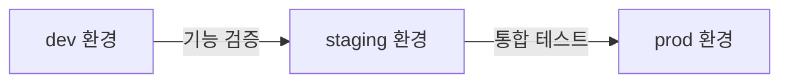

# 테스트 가이드

> bkend 프로젝트에서 테스트를 수행하는 방법을 안내합니다.

## 개요

bkend의 환경 분리 기능을 활용하면 프로덕션 데이터에 영향을 주지 않고 안전하게 테스트할 수 있습니다. dev 환경에서 기능을 검증하고, staging에서 통합 테스트를 수행하세요.

---

## 테스트 환경 전략



| 환경 | 목적 | 테스트 유형 |
|------|------|-----------|
| **dev** | 기능 개발, 단위 테스트 | API 동작 검증, 스키마 테스트 |
| **staging** | 통합 테스트, QA | 전체 흐름 테스트, 성능 테스트 |
| **prod** | 실제 운영 | 스모크 테스트 (최소한) |

---

## API 테스트하기

### 기본 CRUD 테스트

테이블의 기본 CRUD 동작을 검증하세요.

```typescript
const API_URL = 'https://api.bkend.io';
const API_KEY = '{your_dev_api_key}';

// 1. 데이터 삽입 (Create)
const createRes = await fetch(`${API_URL}/data/posts`, {
  method: 'POST',
  headers: {
    'Content-Type': 'application/json',
    'X-API-Key': API_KEY
  },
  body: JSON.stringify({
    title: '테스트 게시글',
    content: '테스트 내용'
  })
});
const created = await createRes.json();
console.assert(createRes.status === 201, 'Create 성공');

// 2. 데이터 조회 (Read)
const readRes = await fetch(`${API_URL}/data/posts/${created._id}`, {
  headers: { 'X-API-Key': API_KEY }
});
const read = await readRes.json();
console.assert(read.title === '테스트 게시글', 'Read 성공');

// 3. 데이터 수정 (Update)
const updateRes = await fetch(`${API_URL}/data/posts/${created._id}`, {
  method: 'PATCH',
  headers: {
    'Content-Type': 'application/json',
    'X-API-Key': API_KEY
  },
  body: JSON.stringify({ title: '수정된 게시글' })
});
console.assert(updateRes.status === 200, 'Update 성공');

// 4. 데이터 삭제 (Delete)
const deleteRes = await fetch(`${API_URL}/data/posts/${created._id}`, {
  method: 'DELETE',
  headers: { 'X-API-Key': API_KEY }
});
console.assert(deleteRes.status === 200, 'Delete 성공');
```

### 인증 테스트

User 인증 흐름을 검증하세요.

```typescript
// 1. 회원가입
const signupRes = await fetch(`${API_URL}/auth/email/signup`, {
  method: 'POST',
  headers: { 'Content-Type': 'application/json' },
  body: JSON.stringify({
    email: 'test@example.com',
    password: 'TestPassword123!'
  })
});

// 2. 로그인
const signinRes = await fetch(`${API_URL}/auth/email/signin`, {
  method: 'POST',
  headers: { 'Content-Type': 'application/json' },
  body: JSON.stringify({
    email: 'test@example.com',
    password: 'TestPassword123!'
  })
});
const { accessToken } = await signinRes.json();

// 3. 인증된 요청
const authRes = await fetch(`${API_URL}/data/posts`, {
  headers: {
    'Authorization': `Bearer ${accessToken}`,
    'X-API-Key': API_KEY
  }
});
console.assert(authRes.status === 200, '인증된 요청 성공');
```

---

## 권한 테스트하기

테이블의 RBAC 설정이 올바르게 동작하는지 검증하세요.

### 테스트 시나리오

| 시나리오 | 예상 결과 |
|---------|---------|
| guest가 read 시도 (read 허용) | ✅ 200 성공 |
| guest가 create 시도 (create 금지) | ❌ 403 거부 |
| user가 다른 user의 데이터 수정 (self만 허용) | ❌ 403 거부 |
| user가 본인 데이터 수정 (self 허용) | ✅ 200 성공 |
| admin이 모든 데이터 접근 | ✅ 200 성공 |

```typescript
// guest 접근 테스트 (API Key만, 토큰 없음)
const guestRes = await fetch(`${API_URL}/data/posts`, {
  method: 'POST',
  headers: {
    'Content-Type': 'application/json',
    'X-API-Key': API_KEY
  },
  body: JSON.stringify({ title: 'guest 작성 시도' })
});
console.assert(guestRes.status === 403, 'guest create 거부');
```

---

## 환경별 테스트 가이드

### dev 환경

- 새로운 기능을 자유롭게 테스트하세요.
- 테이블 스키마를 실험적으로 변경할 수 있습니다.
- 테스트 데이터를 자유롭게 생성/삭제하세요.

### staging 환경

- prod와 동일한 스키마를 유지하세요.
- 실제 사용 시나리오를 재현하여 테스트하세요.
- 성능 테스트를 수행하세요.

### prod 환경

- 배포 후 최소한의 스모크 테스트만 수행하세요.
- 주요 API 엔드포인트의 응답을 확인하세요.
- 테스트 데이터를 생성하지 마세요.

> ⚠️ **주의** - prod 환경에서는 테스트 데이터를 절대 생성하지 마세요. 실제 User 데이터와 혼동될 수 있습니다.

---

## 테스트 자동화

### 테스트 스크립트 예시

```typescript
// test-api.ts
async function runTests() {
  const results: { name: string; passed: boolean }[] = [];

  // 테스트 1: 테이블 목록 조회
  try {
    const res = await fetch(`${API_URL}/data/posts`, {
      headers: { 'X-API-Key': API_KEY }
    });
    results.push({ name: 'GET /data/posts', passed: res.status === 200 });
  } catch (e) {
    results.push({ name: 'GET /data/posts', passed: false });
  }

  // 테스트 2: 인증 흐름
  try {
    const res = await fetch(`${API_URL}/auth/email/signin`, {
      method: 'POST',
      headers: { 'Content-Type': 'application/json' },
      body: JSON.stringify({ email: 'test@example.com', password: 'Test123!' })
    });
    results.push({ name: 'POST /auth/email/signin', passed: res.status === 200 });
  } catch (e) {
    results.push({ name: 'POST /auth/email/signin', passed: false });
  }

  // 결과 출력
  console.log('\n테스트 결과:');
  for (const r of results) {
    console.log(`${r.passed ? '✅' : '❌'} ${r.name}`);
  }
}

runTests();
```

---

## 테스트 체크리스트

- [ ] CRUD 동작이 모든 테이블에서 정상 동작하는지 확인
- [ ] 권한 설정(admin/user/guest/self)이 올바르게 적용되는지 확인
- [ ] 인증 흐름(회원가입 → 로그인 → 토큰 갱신)이 정상 동작하는지 확인
- [ ] 파일 업로드/다운로드가 정상 동작하는지 확인
- [ ] 에러 응답이 올바른 HTTP 상태 코드를 반환하는지 확인
- [ ] 페이지네이션/필터링/정렬이 정상 동작하는지 확인

---

## 관련 문서

- [환경 개요](../platform/01-environments.md) — 환경 분리 전략
- [데이터 조회](../database/07-select.md) — 조회 API 테스트
- [RLS 정책 작성](../security/06-rls-policies.md) — 권한 테스트
- [에러 코드 레퍼런스](../api-reference/10-error-codes.md) — 에러 응답 확인
