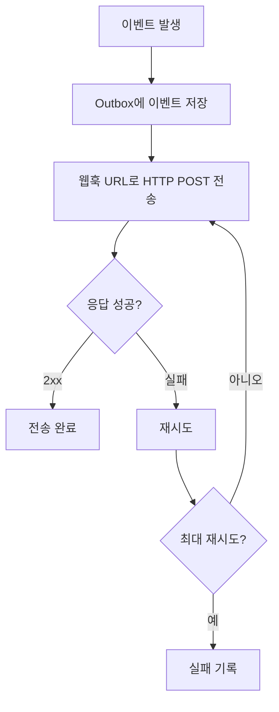

# 웹훅 설정

> bkend의 이벤트를 외부 서비스로 전달하는 웹훅을 설정하는 방법을 안내합니다.

## 개요

bkend는 데이터 변경, 사용자 활동 등 주요 이벤트가 발생할 때 웹훅으로 외부 URL에 알림을 전송합니다. 이를 활용하여 슬랙 알림, 이메일 발송, 외부 시스템 연동 등을 구현할 수 있습니다.

> 🚧 **확인 필요** - 웹훅 기능은 Starter 플랜 이상에서 사용할 수 있습니다. 구체적인 설정 API는 업데이트 중입니다.

---

## 이벤트 타입

bkend에서 발행되는 주요 이벤트입니다.

### 리소스 이벤트

| 이벤트 | 설명 |
|--------|------|
| `user.created` | 새 User 생성 |
| `user.updated` | User 정보 수정 |
| `user.deleted` | User 삭제 |
| `organization.created` | Organization 생성 |
| `organization.updated` | Organization 수정 |
| `organization.deleted` | Organization 삭제 |
| `project.created` | 프로젝트 생성 |
| `project.updated` | 프로젝트 수정 |
| `project.deleted` | 프로젝트 삭제 |

### 데이터 이벤트

| 이벤트 | 설명 |
|--------|------|
| `order.created` | 주문 생성 |
| `order.completed` | 주문 완료 |
| `order.cancelled` | 주문 취소 |
| `order.refunded` | 주문 환불 |
| `payment.succeeded` | 결제 성공 |
| `payment.failed` | 결제 실패 |

---

## 이벤트 페이로드

웹훅으로 전송되는 이벤트 데이터 형식입니다.

```json
{
  "id": "evt_abc123",
  "eventType": "user.created",
  "aggregateType": "User",
  "aggregateId": "user_xyz789",
  "payload": {
    "email": "new@example.com",
    "role": "user",
    "createdAt": "2025-01-15T10:30:00Z"
  },
  "occurredAt": "2025-01-15T10:30:00Z",
  "metadata": {}
}
```

### 페이로드 필드

| 필드 | 타입 | 설명 |
|------|------|------|
| `id` | string | 이벤트 고유 ID |
| `eventType` | string | 이벤트 타입 (`user.created` 등) |
| `aggregateType` | string | 리소스 유형 (`User`, `Order` 등) |
| `aggregateId` | string | 리소스 ID |
| `payload` | object | 이벤트 데이터 |
| `occurredAt` | string | 이벤트 발생 시간 (ISO 8601) |
| `metadata` | object | 추가 메타데이터 |

---

## 웹훅 설정하기

프로젝트 설정에서 웹훅 URL을 등록하세요.



### 재시도 정책

웹훅 전송이 실패하면 자동으로 재시도합니다.

| 재시도 | 대기 시간 | 설명 |
|--------|---------|------|
| 1차 | 1분 | 첫 번째 재시도 |
| 2차 | 5분 | 두 번째 재시도 |
| 3차 | 30분 | 세 번째 재시도 |
| 4차 | 2시간 | 네 번째 재시도 |
| 5차 | 24시간 | 마지막 재시도 |

> 💡 **Tip** - 웹훅 수신 서버는 2xx 응답을 빠르게 반환하세요. 3초 이내에 응답하지 않으면 타임아웃으로 처리됩니다.

---

## 웹훅 수신 서버 구현하기

### Node.js (Express) 예시

```typescript
import express from 'express';

const app = express();
app.use(express.json());

app.post('/webhook', (req, res) => {
  const event = req.body;

  console.log(`이벤트 수신: ${event.eventType}`);
  console.log(`리소스: ${event.aggregateType} (${event.aggregateId})`);

  // 이벤트 타입별 처리
  switch (event.eventType) {
    case 'user.created':
      // 새 사용자 환영 이메일 발송
      sendWelcomeEmail(event.payload.email);
      break;
    case 'order.completed':
      // 주문 완료 슬랙 알림
      notifySlack(`주문 완료: ${event.aggregateId}`);
      break;
    default:
      console.log(`처리하지 않는 이벤트: ${event.eventType}`);
  }

  // 빠르게 2xx 응답 반환
  res.status(200).json({ received: true });
});

app.listen(3000, () => {
  console.log('웹훅 서버 시작: http://localhost:3000');
});
```

### 멱등성 보장

동일한 이벤트가 중복 전달될 수 있으므로 멱등성을 보장하세요.

```typescript
const processedEvents = new Set<string>();

app.post('/webhook', (req, res) => {
  const event = req.body;

  // 중복 이벤트 확인
  if (processedEvents.has(event.id)) {
    return res.status(200).json({ received: true, duplicate: true });
  }

  // 이벤트 처리
  processEvent(event);
  processedEvents.add(event.id);

  res.status(200).json({ received: true });
});
```

---

## 활용 사례

| 이벤트 | 활용 | 연동 서비스 |
|--------|------|-----------|
| `user.created` | 환영 이메일 발송 | SendGrid, Mailgun |
| `user.deleted` | 데이터 정리 | 내부 시스템 |
| `order.completed` | 알림 전송 | Slack, Discord |
| `payment.failed` | 결제 실패 알림 | 이메일, SMS |

---

## 웹훅 보안

### 권장사항

| 항목 | 설명 |
|------|------|
| **HTTPS 사용** | 웹훅 URL은 반드시 HTTPS를 사용하세요 |
| **IP 화이트리스트** | 웹훅 수신 서버에 bkend IP만 허용하세요 |
| **타임아웃 설정** | 3초 이내에 응답을 반환하세요 |
| **멱등성 보장** | 이벤트 ID로 중복 처리를 방지하세요 |
| **에러 로깅** | 웹훅 수신 실패를 로깅하세요 |

---

## 관련 문서

- [감사 로그](../security/08-audit-logs.md) — 이벤트 로그 조회
- [모니터링 대시보드](../platform/05-monitoring.md) — 활동 모니터링
- [결제 & 플랜](../platform/08-billing.md) — 웹훅 지원 플랜
