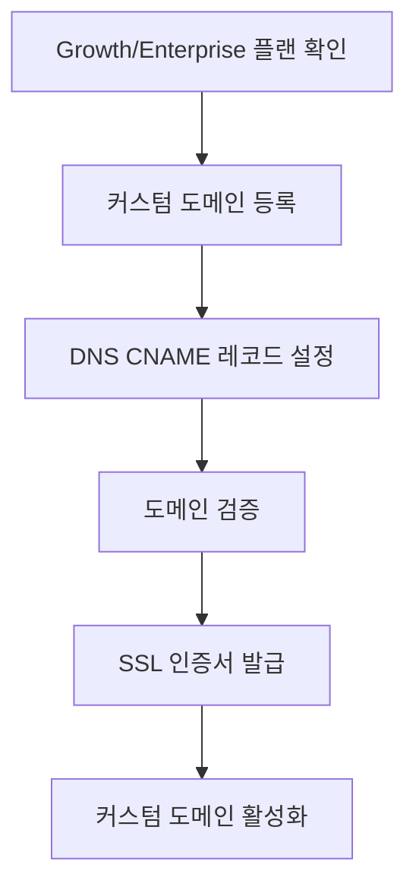

# 커스텀 도메인

> 프로젝트에 커스텀 도메인을 설정하는 방법을 안내합니다.

## 개요

커스텀 도메인을 설정하면 bkend API를 자체 도메인으로 제공할 수 있습니다. 이 기능은 **Growth** 플랜 이상에서 사용할 수 있습니다.

> 🚧 **확인 필요** - 커스텀 도메인 기능의 구체적인 설정 API는 업데이트 중입니다.

---

## 플랜별 지원

| 플랜 | 커스텀 도메인 |
|------|:-----------:|
| Free | ❌ |
| Starter | ❌ |
| Growth | ✅ |
| Enterprise | ✅ |

---

## 설정 흐름



---

## 1단계: 플랜 확인하기

커스텀 도메인은 Growth 또는 Enterprise 플랜에서 사용할 수 있습니다.

1. 콘솔에서 Organization **설정** 페이지로 이동하세요.
2. **General** 탭에서 현재 플랜을 확인하세요.
3. Growth 미만이라면 플랜을 업그레이드하세요.

---

## 2단계: 도메인 등록하기

Organization 설정에서 커스텀 도메인을 등록하세요.

| 설정 | 예시 |
|------|------|
| **커스텀 도메인** | `api.myapp.com` |
| **기본 도메인** | `{project}.api.bkend.io` |

---

## 3단계: DNS 설정하기

도메인 등록 기관에서 CNAME 레코드를 설정하세요.

| 타입 | 호스트 | 값 | TTL |
|------|--------|------|-----|
| CNAME | `api` | `{project}.api.bkend.io` | 3600 |

### DNS 설정 예시

```
# DNS 레코드 예시
api.myapp.com.  3600  IN  CNAME  my-project.api.bkend.io.
```

> 💡 **Tip** - DNS 변경은 전파에 최대 48시간이 소요될 수 있습니다. 대부분의 경우 몇 분 이내에 적용됩니다.

---

## 4단계: 도메인 검증하기

DNS 레코드가 올바르게 설정되면 bkend가 자동으로 도메인을 검증합니다.

| 상태 | 설명 |
|------|------|
| `pending` | DNS 검증 대기 중 |
| `verifying` | DNS 레코드 확인 중 |
| `verified` | 검증 완료, SSL 인증서 발급 중 |
| `active` | 커스텀 도메인 사용 가능 |
| `failed` | 검증 실패 (DNS 설정 확인 필요) |

---

## 5단계: SSL 인증서

도메인 검증이 완료되면 SSL 인증서가 자동으로 발급됩니다.

| 항목 | 설명 |
|------|------|
| **발급** | 자동 (검증 후) |
| **갱신** | 자동 갱신 |
| **프로토콜** | HTTPS 강제 |

---

## 사용 예시

커스텀 도메인 설정 후 API를 호출하는 방법입니다.

```typescript
// 기본 도메인
const response = await fetch('https://my-project.api.bkend.io/data/posts', {
  headers: { 'X-API-Key': '{your_api_key}' }
});

// 커스텀 도메인
const response = await fetch('https://api.myapp.com/data/posts', {
  headers: { 'X-API-Key': '{your_api_key}' }
});
```

---

## 트러블슈팅

| 문제 | 원인 | 해결 방법 |
|------|------|---------|
| 검증 실패 | DNS 레코드 미설정 또는 오류 | CNAME 레코드를 확인하세요 |
| SSL 오류 | 인증서 미발급 | 검증 완료 후 잠시 기다리세요 |
| 연결 불가 | DNS 전파 미완료 | 최대 48시간 기다리세요 |
| 403 에러 | API Key 불일치 | 커스텀 도메인용 API Key를 확인하세요 |

> ⚠️ **주의** - 커스텀 도메인을 변경하거나 삭제하면 기존 도메인으로의 API 호출이 즉시 중단됩니다. 클라이언트 코드를 먼저 업데이트하세요.

---

## 관련 문서

- [결제 & 플랜](../platform/08-billing.md) — Growth 플랜 이상 필요
- [API Key 관리](../security/02-api-keys.md) — API Key 설정
- [보안 모범 사례](../security/09-best-practices.md) — HTTPS 보안
