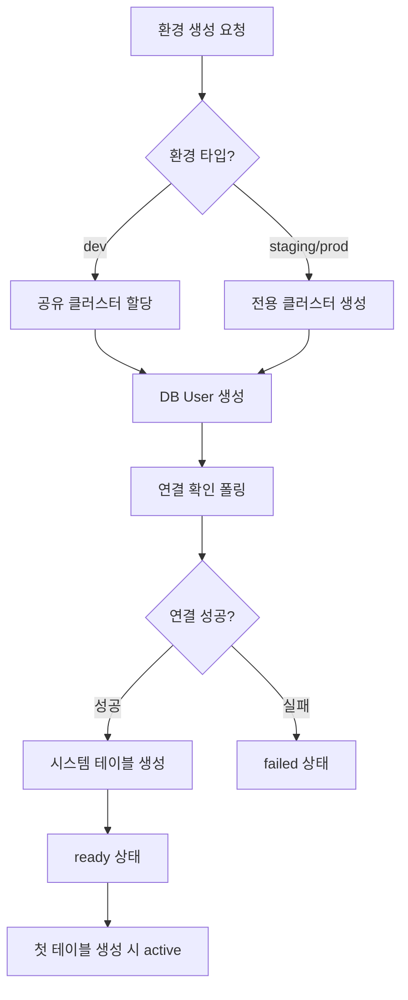
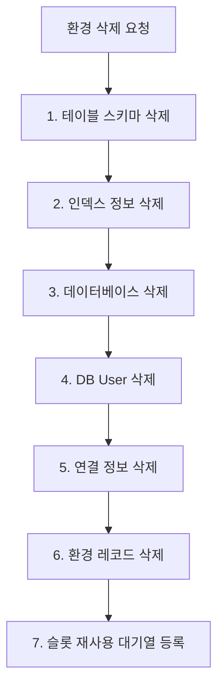

# 배포 가이드

> 환경을 생성하고 배포하는 프로세스를 안내합니다.

## 개요

bkend에서 환경을 생성하면 자동으로 데이터베이스 클러스터가 프로비저닝됩니다. 환경 타입에 따라 배포 방식과 소요 시간이 다릅니다.

---

## 환경 생성 프로세스

### 전체 흐름

### Dev 환경 배포

Dev 환경은 공유 클러스터를 사용하여 빠르게 프로비저닝됩니다.

**할당 우선순위:**

1. **삭제된 슬롯 재사용** — 이전에 삭제된 환경의 슬롯을 재활용합니다 (FIFO).
2. **기존 클러스터 빈 슬롯** — 여유 공간이 있는 클러스터에 할당합니다.
3. **예비 클러스터** — 빈 슬롯이 없으면 예비 클러스터를 사용합니다.

**소요 시간:** 약 1분

### Staging / Prod 환경 배포

전용 클러스터를 새로 생성합니다.

**프로세스:**

1. MongoDB Atlas에 전용 클러스터를 생성합니다.
2. 클러스터 프로비저닝이 완료될 때까지 폴링합니다.
3. DB User를 생성하고 연결을 확인합니다.

**소요 시간:** 약 5~10분

---

## 배포 상태 확인하기

콘솔의 **Environments** 페이지에서 각 환경의 배포 상태를 확인할 수 있습니다.

| 상태 | 설명 | 다음 단계 |
|------|------|----------|
| `creating` | 클러스터 프로비저닝 중 | 완료까지 대기 |
| `ready` | 프로비저닝 완료 | 테이블을 생성하여 활성화 |
| `active` | 운영 중 | 정상 사용 |
| `failed` | 프로비저닝 실패 | 에러 확인 후 재생성 |
| `deleting` | 삭제 진행 중 | 완료까지 대기 |

---

## 환경 삭제하기

환경을 삭제하면 다음 7단계가 순차적으로 실행됩니다.

| 단계 | 작업 | 설명 |
|------|------|------|
| 1-2 | 메타데이터 정리 | 테이블 스키마, 인덱스 정보 삭제 |
| 3 | 데이터베이스 삭제 | 환경의 전체 데이터베이스 삭제 |
| 4 | DB User 삭제 | Atlas DB User 제거 |
| 5 | 연결 정보 삭제 | 데이터베이스 연결 문자열 제거 |
| 6 | 환경 레코드 삭제 | 환경 메타데이터 제거 |
| 7 | 슬롯 등록 | 삭제된 슬롯을 재사용 대기열에 등록 |

> ❌ **위험** - 환경 삭제는 되돌릴 수 없습니다. 해당 환경의 모든 테이블, User, 파일이 영구적으로 삭제됩니다.

---

## 배포 실패 시 대응하기

환경 상태가 `failed`인 경우 다음을 확인하세요.

| 원인 | 대응 |
|------|------|
| 플랜 제한 초과 | 플랜을 업그레이드하거나 미사용 환경을 삭제하세요 |
| 리전 가용성 문제 | 다른 리전으로 재시도하세요 |
| 일시적인 오류 | 잠시 후 다시 시도하세요 |

> 💡 **Tip** - `failed` 상태의 환경은 콘솔에서 에러 메시지를 확인할 수 있습니다. 에러 내용을 참고하여 문제를 해결하세요.

---

## 관련 문서

- [환경 개요](01-environments.md) — 환경 타입과 특징
- [환경 전환하기](02-env-switching.md) — 콘솔에서 환경 전환
- [모니터링 대시보드](05-monitoring.md) — 환경 상태 모니터링
