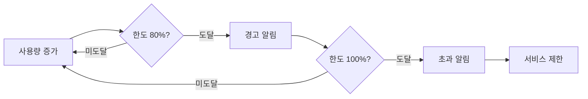

# 사용량 분석

> 프로젝트의 사용량 메트릭을 조회하고 분석하는 방법을 안내합니다.

## 개요

bkend는 API 호출, 저장소, 대역폭 등 다양한 사용량 메트릭을 자동으로 수집합니다. 조직과 프로젝트 단위로 사용량을 조회할 수 있습니다.

---

## 사용량 메트릭 타입

| 메트릭 | 설명 | 단위 |
|--------|------|------|
| `api_call` | API 호출 수 | 건 |
| `mau` | 월간 활성 User 수 | 명 |
| `storage` | 저장소 사용량 | GB |
| `bandwidth` | 대역폭 사용량 | GB |
| `db_read` | 데이터베이스 읽기 작업 | 건 |
| `db_write` | 데이터베이스 쓰기 작업 | 건 |
| `file_upload` | 파일 업로드 수 | 건 |
| `file_download` | 파일 다운로드 수 | 건 |

---

## 집계 단위

메트릭은 시간 단위로 집계되어 저장됩니다.

| 집계 단위 | 보존 기간 | 용도 |
|----------|---------|------|
| `hourly` | 7일 | 시간별 상세 트렌드 분석 |
| `daily` | 90일 | 일별 사용 패턴 확인 |
| `monthly` | 2년 | 월별 청구 및 장기 트렌드 |

---

## 사용량 조회하기

### 조회 파라미터

| 파라미터 | 타입 | 필수 | 설명 |
|---------|------|------|------|
| `organizationId` | string | ✅ | Organization ID |
| `projectId` | string | - | Project ID (특정 프로젝트 필터) |
| `type` | string | - | 메트릭 타입 (예: `api_call`) |
| `startDate` | string | - | 조회 시작일 (ISO 8601) |
| `endDate` | string | - | 조회 종료일 (ISO 8601) |

### 응답 형식

```json
{
  "items": [
    {
      "id": "metric_...",
      "organizationId": "org_...",
      "projectId": "proj_...",
      "metricType": "api_call",
      "period": "daily",
      "periodStart": "2025-01-01T00:00:00Z",
      "periodEnd": "2025-01-02T00:00:00Z",
      "value": 15234,
      "metadata": {
        "successCount": 14890,
        "failureCount": 344,
        "avgResponseTime": 125
      }
    }
  ],
  "total": 31,
  "page": 1,
  "limit": 10
}
```

### 메타데이터 상세

각 메트릭에는 추가 상세 정보가 포함됩니다.

| 필드 | 설명 |
|------|------|
| `successCount` | 성공 건수 |
| `failureCount` | 실패 건수 |
| `avgResponseTime` | 평균 응답 시간 (ms) |
| `peakValue` | 최대값 |
| `minValue` | 최소값 |
| `endpoints` | API 엔드포인트별 호출 수 |

---

## 플랜별 사용량 한도

| 항목 | Free | Starter | Growth | Enterprise |
|------|------|---------|--------|-----------|
| API 호출 (월) | 10,000 | 100,000 | 1,000,000 | 무제한 |
| 저장소 | 1 GB | 10 GB | 100 GB | 무제한 |
| MAU | 1,000 | 10,000 | 100,000 | 무제한 |
| 대역폭 (월) | 5 GB | 50 GB | 500 GB | 무제한 |

---

## 사용량 알림

한도에 근접하면 자동으로 알림이 발송됩니다.



| 단계 | 조건 | 알림 |
|------|------|------|
| 경고 | 한도의 80% 도달 | 이메일 알림 + 대시보드 배너 |
| 초과 임박 | 한도의 100% 도달 | 이메일 알림 + 대시보드 배너 |
| 서비스 제한 | 한도 초과 | API 호출 제한 (429 에러) |

> 💡 **Tip** - 알림은 Organization의 알림 이메일로 발송됩니다. **설정** > **General** 에서 알림 이메일을 확인하세요.

---

## 사용량 최적화 팁

| 영역 | 권장사항 |
|------|---------|
| **API 호출** | 불필요한 반복 호출을 줄이고, 클라이언트 캐싱을 활용하세요 |
| **저장소** | 미사용 파일을 정리하고, 이미지는 압축 후 업로드하세요 |
| **대역폭** | CDN을 활용하고, public 파일을 적절히 설정하세요 |
| **DB 호출** | 필터링과 페이지네이션을 활용하여 불필요한 데이터 전송을 줄이세요 |

---

## 관련 문서

- [모니터링 대시보드](05-monitoring.md) — 서비스 상태 모니터링
- [결제 & 플랜](08-billing.md) — 플랜별 한도와 업그레이드
- [성능 최적화](../guides/04-performance.md) — 성능 최적화 가이드
