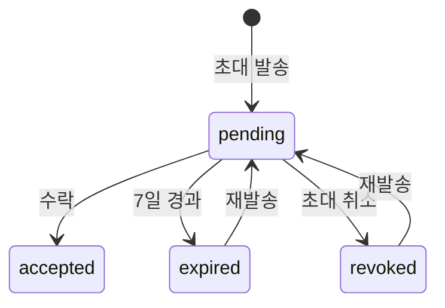

# 팀 멤버 관리

> Organization에 팀 멤버를 초대하고 역할을 관리하는 방법을 안내합니다.

## 개요

bkend는 Organization 단위로 팀을 관리합니다. 멤버를 초대하고, 역할을 부여하여 프로젝트에 대한 접근 권한을 제어할 수 있습니다.

---

## Organization 역할

| 역할 | 설명 | 주요 권한 |
|------|------|----------|
| **Owner** | 조직 소유자 | 모든 권한 + 조직 삭제/양도 |
| **Admin** | 관리자 | 조직 설정, 멤버 관리, 프로젝트 관리 |
| **Member** | 일반 멤버 | 프로젝트 사용 (읽기/쓰기) |
| **Billing** | 결제 담당 | 결제 정보 관리 |

### 역할별 권한 매트릭스

| 작업 | Owner | Admin | Member | Billing |
|------|:-----:|:-----:|:------:|:-------:|
| 조직 정보 조회 | ✅ | ✅ | ✅ | ✅ |
| 조직 설정 수정 | ✅ | ✅ | - | - |
| 프로젝트 생성/삭제 | ✅ | ✅ | - | - |
| 프로젝트 사용 | ✅ | ✅ | ✅ | - |
| 환경 생성/삭제 | ✅ | ✅ | - | - |
| 멤버 초대 | ✅ | ✅ | - | - |
| 멤버 역할 변경 | ✅ | ✅ | - | - |
| 멤버 제거 | ✅ | - | - | - |
| 조직 삭제 | ✅ | - | - | - |
| 소유권 이전 | ✅ | - | - | - |
| 결제 정보 관리 | ✅ | - | - | ✅ |

---

## 멤버 초대하기

### 콘솔에서 초대하기

1. Organization의 **Team** 페이지로 이동하세요.
2. **멤버 초대** 버튼을 클릭하세요.
3. 초대 정보를 입력하세요.

| 필드 | 설명 |
|------|------|
| **이름** | 초대받는 멤버의 이름 |
| **이메일** | 초대받는 멤버의 이메일 주소 |
| **역할** | 부여할 역할 (Admin, Member, Billing) |

4. **초대 전송** 버튼을 클릭하세요.

> 💡 **Tip** - Admin, Billing 역할은 Owner만 선택할 수 있습니다. Admin은 기본적으로 Member 역할만 초대할 수 있습니다.

### 초대 상태

| 상태 | 색상 | 설명 |
|------|------|------|
| `pending` | 노란색 | 초대 대기 중 |
| `accepted` | 초록색 | 수락 완료 |
| `revoked` | 회색 | 초대 취소됨 |
| `expired` | 빨간색 | 만료됨 (7일 경과) |

### 초대 관리

- **재발송** — 만료되거나 취소된 초대를 다시 발송합니다. 기존 초대는 자동으로 폐기됩니다.
- **취소** — 대기 중인 초대를 취소합니다.

---

## Team 페이지

Team 페이지에서 모든 멤버와 초대 현황을 확인할 수 있습니다.

### 멤버 목록

| 컬럼 | 설명 |
|------|------|
| **Member** | 아바타, 이름, 이메일, 본인 표시("You") |
| **Role** | 역할 배지 (아이콘 + 색상) |
| **Status** | 활성 상태 |
| **Joined** | 가입일 |
| **Actions** | 역할 변경, 멤버 제거 |

### 검색 및 필터링

| 필터 | 옵션 |
|------|------|
| **검색** | 이름 또는 이메일로 검색 |
| **역할** | All, Owner, Admin, Member, Billing |
| **상태** | All, Active, Pending |

### 역할 배지

| 역할 | 아이콘 | 색상 |
|------|--------|------|
| **Owner** | 왕관 | 금색 |
| **Admin** | 방패 | 파란색 |
| **Member** | 사람 | 회색 |
| **Billing** | 카드 | 초록색 |

---

## 역할 변경하기

1. Team 페이지에서 변경할 멤버의 **⋯** 버튼을 클릭하세요.
2. **역할 변경**을 선택하세요.
3. 새 역할을 선택하세요.
4. **변경** 버튼을 클릭하세요.

> ⚠️ **주의** - 역할 변경 시 해당 멤버의 JWT가 즉시 갱신되어 새 역할이 반영됩니다.

### 역할 변경 규칙

| 규칙 | 설명 |
|------|------|
| 자신보다 낮은 레벨만 변경 가능 | Admin은 Member/Billing만 변경 가능 |
| Owner만 Owner 역할 부여 가능 | Admin이 다른 멤버를 Owner로 승격할 수 없음 |
| 마지막 Owner 변경 불가 | 조직에 최소 1명의 Owner가 필요 |

---

## 멤버 제거하기

1. Team 페이지에서 제거할 멤버의 **⋯** 버튼을 클릭하세요.
2. **멤버 제거**를 선택하세요.
3. 확인 대화상자에서 해당 멤버의 이메일을 정확히 입력하세요.
4. **제거** 버튼을 클릭하세요.

> ❌ **위험** - 멤버를 제거하면 해당 멤버는 Organization의 모든 프로젝트에 즉시 접근할 수 없게 됩니다. Owner만 이 작업을 수행할 수 있습니다.

---

## 조직 관리

### 소유권 이전하기

조직의 소유권을 다른 멤버에게 이전할 수 있습니다.

1. **설정** > **Danger** 탭으로 이동하세요.
2. **소유권 이전** 버튼을 클릭하세요.
3. 새 소유자를 선택하세요.
4. 확인 입력란에 `transfer`를 입력하세요.
5. **이전** 버튼을 클릭하세요.

### 조직 나가기

Organization을 떠나려면 (Owner 제외):

1. **설정** > **Danger** 탭으로 이동하세요.
2. **조직 나가기** 버튼을 클릭하세요.
3. 확인 입력란에 `leave`를 입력하세요.
4. **나가기** 버튼을 클릭하세요.

---

## 관련 문서

- [Organization & Project](../getting-started/06-org-and-project.md) — 조직 구조 이해
- [감사 로그](../security/08-audit-logs.md) — 멤버 활동 로그
- [보안 모범 사례](../security/09-best-practices.md) — 팀 관리 보안 권장사항
