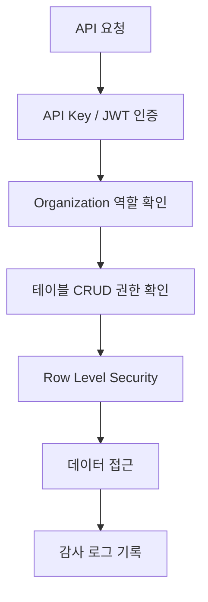

# 보안 개요

> bkend의 보안 모델과 접근 제어 방식을 소개합니다.

## 개요

bkend는 API Key 기반 인증, 역할 기반 접근 제어(RBAC), Row Level Security(RLS), 감사 로그를 통해 데이터를 안전하게 보호합니다.

---

## 보안 계층

---

## 주요 보안 기능

| 기능 | 설명 |
|------|------|
| **API Key** | 프로젝트별 API Key로 서비스 API 인증 |
| **JWT 인증** | User별 Access Token + Refresh Token |
| **Organization 역할** | Owner, Admin, Billing, Member 4단계 |
| **테이블 권한** | admin, user, guest 그룹별 CRUD 권한 |
| **Row Level Security** | 본인 데이터만 접근하는 self 권한 |
| **감사 로그** | 모든 관리 작업 자동 기록 |
| **토큰 해싱** | API Key를 SHA256 해시로 안전하게 저장 |

---

## API 인증 방식

| 방식 | 용도 | 인증 헤더 |
|------|------|----------|
| **API Key** | 서비스 API 호출 | `x-project-id: {project_id}` |
| **JWT Bearer** | 보호된 엔드포인트 | `Authorization: Bearer {accessToken}` |
| **OAuth 2.1 + PKCE** | MCP 도구 연결 | OAuth 플로우 |

---

## 관련 문서

- [API Key 관리](02-api-keys.md) — API Key 생성과 관리
- [Public vs Secret Key](04-public-vs-secret.md) — Key 타입 차이
- [RLS 개요](05-rls-overview.md) — Row Level Security
- [감사 로그](08-audit-logs.md) — 감사 로그 조회
- [보안 모범 사례](09-best-practices.md) — 보안 권장사항
