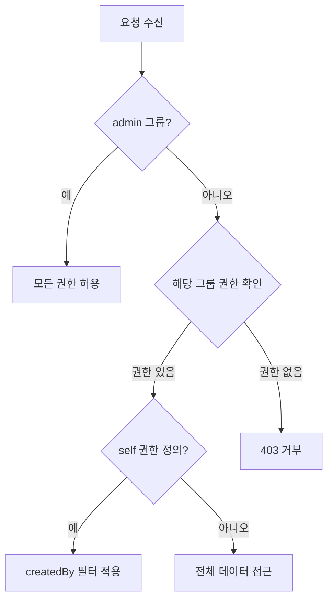

# RLS 정책 작성

> 테이블별 Row Level Security 정책을 작성하는 방법을 안내합니다.

## 개요

RLS 정책은 테이블의 `permissions` 설정을 통해 정의합니다. 사용자 그룹별로 CRUD 권한을 세밀하게 제어할 수 있습니다.

---

## 정책 작성 예시

### 게시판 테이블 (공개 읽기, 작성자만 수정/삭제)

```json
{
  "permissions": {
    "admin": {
      "create": true, "read": true, "update": true, "delete": true
    },
    "user": {
      "create": true, "read": true, "update": false, "delete": false
    },
    "self": {
      "read": true, "update": true, "delete": true
    },
    "guest": {
      "read": true
    }
  }
}
```

### 비공개 메모 테이블 (본인만 접근)

```json
{
  "permissions": {
    "admin": {
      "create": true, "read": true, "update": true, "delete": true
    },
    "user": {
      "create": true, "read": false, "update": false, "delete": false
    },
    "self": {
      "read": true, "update": true, "delete": true
    },
    "guest": {}
  }
}
```

### 공지사항 테이블 (관리자만 작성, 전체 공개)

```json
{
  "permissions": {
    "admin": {
      "create": true, "read": true, "update": true, "delete": true
    },
    "user": {
      "create": false, "read": true
    },
    "guest": {
      "read": true
    }
  }
}
```

---

## 권한 검사 우선순위



1. **admin** 그룹은 항상 모든 작업을 수행할 수 있습니다.
2. 해당 사용자 그룹(user/guest)의 권한을 확인합니다.
3. self 권한이 정의되어 있으면 `createdBy` 필터가 적용됩니다.
4. list 작업은 read 권한이 없으면 read 권한으로 대체 확인합니다.

---

## 시스템 테이블 접근 제어

이름이 `_`로 시작하는 시스템 테이블은 특별한 접근 제어를 따릅니다.

| 조건 | 접근 |
|------|------|
| 테이블이 등록되지 않음 | admin만 접근 가능 |
| 테이블이 등록됨 | permissions 설정에 따라 접근 |

> ⚠️ **주의** - 시스템 테이블(`_user`, `_auth` 등)은 민감한 데이터를 포함할 수 있으므로 권한 설정에 주의하세요.

---

## 관련 문서

- [RLS 개요](05-rls-overview.md) — RLS 개념 소개
- [보안 개요](01-overview.md) — 보안 모델 소개
- [테이블 생성](../database/03-create-table.md) — 권한 설정과 함께 테이블 생성
