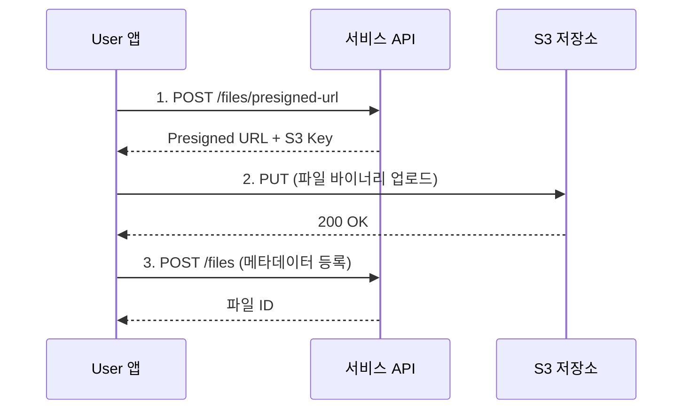

# 단일 파일 업로드

> Presigned URL을 사용하여 단일 파일을 업로드하는 방법을 안내합니다.

## 개요

bkend Storage는 Presigned URL 방식으로 파일을 업로드합니다. 서버를 경유하지 않고 클라이언트에서 S3로 직접 업로드하므로 빠르고 효율적입니다.

---

## 업로드 흐름

파일 업로드는 3단계로 진행됩니다.



---

## 1단계: Presigned URL 요청하기

### 요청

```bash
curl -X POST "https://api.bkend.ai/v1/files/presigned-url" \
  -H "x-project-id: {project_id}" \
  -H "x-environment: dev" \
  -H "Authorization: Bearer {accessToken}" \
  -H "Content-Type: application/json" \
  -d '{
    "filename": "photo.jpg",
    "contentType": "image/jpeg",
    "fileSize": 1048576,
    "visibility": "public",
    "category": "images"
  }'
```

### 파라미터

| 파라미터 | 타입 | 필수 | 설명 |
|---------|------|------|------|
| `filename` | string | ✅ | 원본 파일명 |
| `contentType` | string | ✅ | MIME 타입 (예: `image/jpeg`) |
| `fileSize` | number | - | 파일 크기 (바이트) |
| `visibility` | string | - | 파일 가시성 (기본값: `private`) |
| `category` | string | - | 버킷 카테고리 (기본값: `attachments`) |

### 응답 (200 OK)

```json
{
  "url": "https://s3.amazonaws.com/bucket/...",
  "key": "my-project/public/images/a1b2c3d4/photo.jpg",
  "filename": "photo.jpg",
  "contentType": "image/jpeg"
}
```

| 필드 | 설명 |
|------|------|
| `url` | S3 업로드용 Presigned URL (15분 유효) |
| `key` | S3 객체 키 (3단계에서 사용) |
| `filename` | 정규화된 파일명 |
| `contentType` | MIME 타입 |

---

## 2단계: S3에 파일 업로드하기

Presigned URL로 파일 바이너리를 직접 업로드합니다.

```bash
curl -X PUT "{presigned_url}" \
  -H "Content-Type: image/jpeg" \
  --data-binary @photo.jpg
```

> ⚠️ **주의** - Presigned URL은 15분 동안만 유효합니다. 만료 시 1단계부터 다시 진행하세요.

---

## 3단계: 메타데이터 등록하기

S3 업로드 완료 후 파일 메타데이터를 등록합니다.

### 요청

```bash
curl -X POST "https://api.bkend.ai/v1/files" \
  -H "x-project-id: {project_id}" \
  -H "x-environment: dev" \
  -H "Authorization: Bearer {accessToken}" \
  -H "Content-Type: application/json" \
  -d '{
    "s3Key": "my-project/public/images/a1b2c3d4/photo.jpg",
    "originalName": "photo.jpg",
    "mimeType": "image/jpeg",
    "size": 1048576,
    "width": 1920,
    "height": 1080,
    "visibility": "public",
    "bucket": "images"
  }'
```

### 파라미터

| 파라미터 | 타입 | 필수 | 설명 |
|---------|------|------|------|
| `s3Key` | string | ✅ | 1단계 응답의 `key` 값 |
| `originalName` | string | ✅ | 원본 파일명 |
| `mimeType` | string | ✅ | MIME 타입 |
| `size` | number | ✅ | 파일 크기 (바이트) |
| `width` | number | - | 이미지 너비 (픽셀) |
| `height` | number | - | 이미지 높이 (픽셀) |
| `visibility` | string | - | 파일 가시성 (기본값: `private`) |
| `bucket` | string | - | 버킷 카테고리 |
| `metadata` | object | - | 사용자 정의 메타데이터 |

### 응답 (200 OK)

```json
{
  "id": "file_abc123",
  "createdAt": "2024-01-15T10:30:00Z"
}
```

---

## JavaScript 구현 예시

```typescript
async function uploadFile(file: File, accessToken: string) {
  // 1단계: Presigned URL 요청
  const presignedRes = await fetch(
    'https://api.bkend.ai/v1/files/presigned-url',
    {
      method: 'POST',
      headers: {
        'x-project-id': PROJECT_ID,
        'Authorization': `Bearer ${accessToken}`,
        'Content-Type': 'application/json',
      },
      body: JSON.stringify({
        filename: file.name,
        contentType: file.type,
        fileSize: file.size,
        visibility: 'public',
        category: 'images',
      }),
    }
  );
  const { url, key, filename, contentType } = await presignedRes.json();

  // 2단계: S3에 직접 업로드
  await fetch(url, {
    method: 'PUT',
    headers: { 'Content-Type': contentType },
    body: file,
  });

  // 3단계: 메타데이터 등록
  const fileRes = await fetch('https://api.bkend.ai/v1/files', {
    method: 'POST',
    headers: {
      'x-project-id': PROJECT_ID,
      'Authorization': `Bearer ${accessToken}`,
      'Content-Type': 'application/json',
    },
    body: JSON.stringify({
      s3Key: key,
      originalName: filename,
      mimeType: contentType,
      size: file.size,
      visibility: 'public',
    }),
  });
  return fileRes.json();
}
```

---

## 에러 응답

| 에러 코드 | HTTP 상태 | 설명 |
|----------|----------|------|
| `file/file-too-large` | 400 | 파일 크기 초과 |
| `file/invalid-format` | 400 | 지원하지 않는 파일 형식 |
| `file/invalid-name` | 400 | 유효하지 않은 파일명 |
| `file/s3-key-already-exists` | 409 | 이미 존재하는 S3 키 |
| `file/bucket-not-configured` | 400 | S3 버킷 미설정 |

---

## 관련 문서

- [다중 파일 업로드](05-upload-multiple.md) — 여러 파일 동시 업로드
- [대용량 파일 업로드](06-upload-large.md) — 멀티파트 업로드
- [파일 다운로드](07-download.md) — 파일 다운로드 URL 생성
- [Storage 개요](01-overview.md) — Storage 기능 소개
