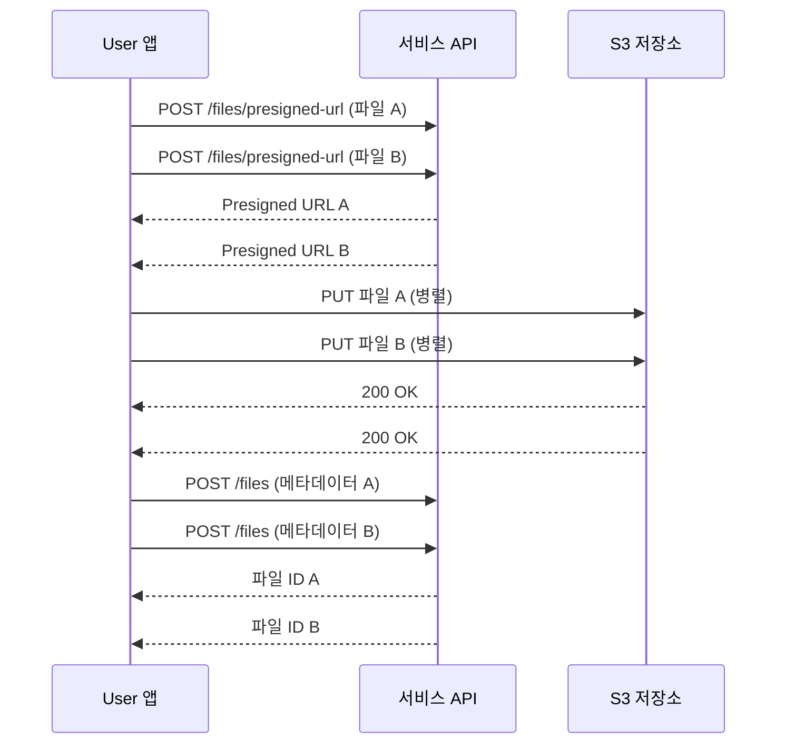

# 다중 파일 업로드

> 여러 파일을 동시에 업로드하는 방법을 안내합니다.

## 개요

bkend Storage에서 여러 파일을 업로드하려면 [단일 파일 업로드](04-upload-single.md)를 병렬로 실행합니다. 각 파일마다 Presigned URL을 요청하고 S3에 업로드한 후 메타데이터를 등록하는 3단계를 반복합니다.

---

## 다중 업로드 흐름



---

## JavaScript 구현 예시

```typescript
async function uploadMultipleFiles(
  files: File[],
  accessToken: string
) {
  const results = await Promise.all(
    files.map(async (file) => {
      // 1단계: Presigned URL 요청
      const presignedRes = await fetch(
        'https://api.bkend.ai/v1/files/presigned-url',
        {
          method: 'POST',
          headers: {
            'x-project-id': PROJECT_ID,
            'Authorization': `Bearer ${accessToken}`,
            'Content-Type': 'application/json',
          },
          body: JSON.stringify({
            filename: file.name,
            contentType: file.type,
            fileSize: file.size,
          }),
        }
      );
      const { url, key, filename, contentType } =
        await presignedRes.json();

      // 2단계: S3에 직접 업로드
      await fetch(url, {
        method: 'PUT',
        headers: { 'Content-Type': contentType },
        body: file,
      });

      // 3단계: 메타데이터 등록
      const fileRes = await fetch('https://api.bkend.ai/v1/files', {
        method: 'POST',
        headers: {
          'x-project-id': PROJECT_ID,
          'Authorization': `Bearer ${accessToken}`,
          'Content-Type': 'application/json',
        },
        body: JSON.stringify({
          s3Key: key,
          originalName: filename,
          mimeType: contentType,
          size: file.size,
        }),
      });
      return fileRes.json();
    })
  );

  return results;
}
```

---

## 동시 업로드 수 제어하기

대량 파일 업로드 시 동시 요청 수를 제한하여 안정성을 확보하세요.

```typescript
async function uploadWithConcurrencyLimit(
  files: File[],
  accessToken: string,
  concurrency: number = 3
) {
  const results: any[] = [];

  for (let i = 0; i < files.length; i += concurrency) {
    const batch = files.slice(i, i + concurrency);
    const batchResults = await Promise.all(
      batch.map((file) => uploadSingleFile(file, accessToken))
    );
    results.push(...batchResults);
  }

  return results;
}
```

> 💡 **Tip** - 동시 업로드 수는 3~5개를 권장합니다. 너무 많으면 네트워크 대역폭이 분산되어 전체 속도가 느려질 수 있습니다.

---

## 에러 처리

다중 업로드 시 일부 파일만 실패할 수 있습니다. 각 파일의 결과를 개별적으로 확인하세요.

```typescript
const results = await Promise.allSettled(
  files.map((file) => uploadSingleFile(file, accessToken))
);

const succeeded = results.filter((r) => r.status === 'fulfilled');
const failed = results.filter((r) => r.status === 'rejected');

console.log(`성공: ${succeeded.length}개, 실패: ${failed.length}개`);
```

---

## 관련 문서

- [단일 파일 업로드](04-upload-single.md) — Presigned URL 업로드 상세
- [대용량 파일 업로드](06-upload-large.md) — 멀티파트 업로드
- [Storage 개요](01-overview.md) — Storage 기능 소개
