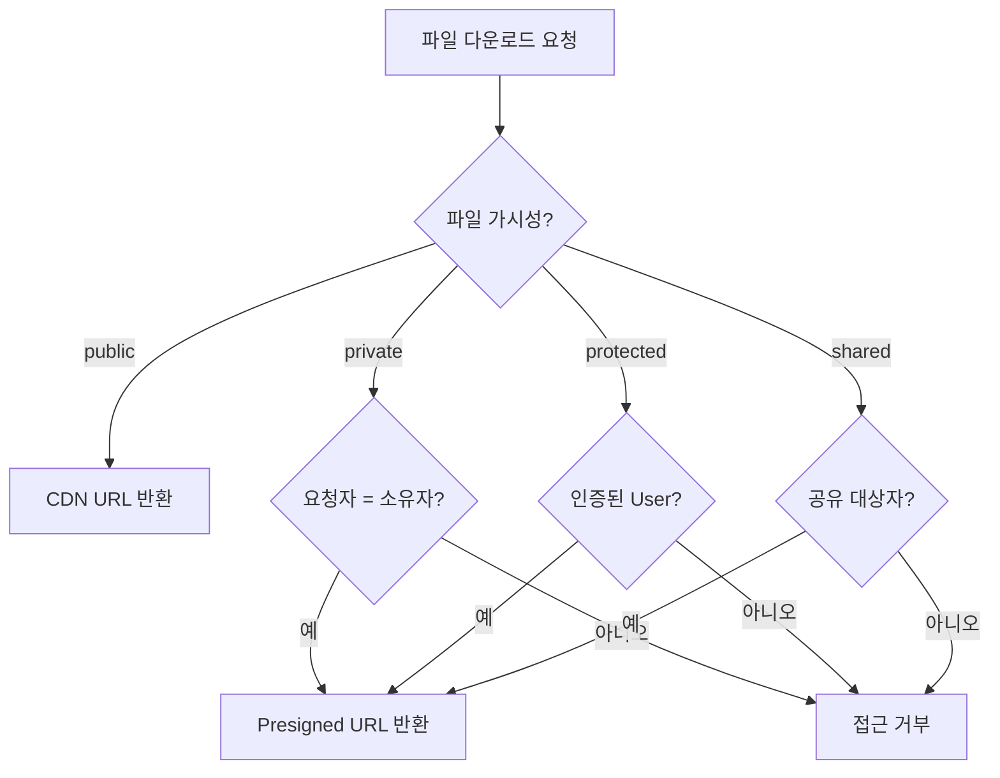

# 파일 접근 권한

> 파일의 가시성과 소유자 타입을 설정하여 접근 권한을 제어하는 방법을 안내합니다.

## 개요

bkend Storage는 파일 가시성(visibility)과 소유자 타입(ownerType)을 통해 접근 권한을 제어합니다. 파일 업로드 시 또는 업로드 후에 권한을 설정할 수 있습니다.

---

## 파일 가시성

| 가시성 | 설명 | 다운로드 URL | 접근 범위 |
|--------|------|-------------|----------|
| `public` | 공개 파일 | CDN URL (만료 없음) | 누구나 |
| `private` | 비공개 파일 (기본값) | Presigned URL (1시간) | 소유자만 |
| `protected` | 보호된 파일 | Presigned URL (1시간) | 인증된 User |
| `shared` | 공유 파일 | Presigned URL (1시간) | 공유 대상자 |

---

## 소유자 타입

| 타입 | 설명 | 사용 사례 |
|------|------|----------|
| `user` | User 소유 (기본값) | User가 업로드한 파일 |
| `session` | 세션 기반 소유 | 비로그인 임시 업로드 |
| `service` | 서비스 소유 | 시스템 자동 생성 파일 |
| `public` | 공개 소유 | 공용 리소스 |

---

## 업로드 시 권한 설정하기

Presigned URL 요청 시 `visibility`를 지정합니다.

```bash
curl -X POST "https://api.bkend.ai/v1/files/presigned-url" \
  -H "x-project-id: {project_id}" \
  -H "x-environment: dev" \
  -H "Authorization: Bearer {accessToken}" \
  -H "Content-Type: application/json" \
  -d '{
    "filename": "photo.jpg",
    "contentType": "image/jpeg",
    "visibility": "public"
  }'
```

메타데이터 등록 시에도 `visibility`와 `ownerType`을 지정합니다.

```bash
curl -X POST "https://api.bkend.ai/v1/files" \
  -H "x-project-id: {project_id}" \
  -H "x-environment: dev" \
  -H "Authorization: Bearer {accessToken}" \
  -H "Content-Type: application/json" \
  -d '{
    "s3Key": "{s3_key}",
    "originalName": "photo.jpg",
    "mimeType": "image/jpeg",
    "size": 1048576,
    "visibility": "public",
    "ownerType": "user"
  }'
```

---

## 업로드 후 권한 변경하기

파일 수정 API로 가시성을 변경할 수 있습니다.

```bash
curl -X PATCH "https://api.bkend.ai/v1/files/{fileId}" \
  -H "x-project-id: {project_id}" \
  -H "x-environment: dev" \
  -H "Authorization: Bearer {accessToken}" \
  -H "Content-Type: application/json" \
  -d '{
    "visibility": "private"
  }'
```

---

## 접근 제어 흐름



---

## 목록 조회 접근 제어

파일 목록 조회 시 접근 권한에 따라 결과가 필터링됩니다.

| 요청자 | 조회 가능한 파일 |
|--------|---------------|
| 관리자 | 모든 파일 |
| 일반 User | 본인이 업로드한 파일만 |

---

## 보안 권장사항

| 권장사항 | 설명 |
|---------|------|
| 기본값은 private | 민감한 파일은 기본 `private`으로 업로드하세요 |
| 최소 권한 원칙 | 필요한 최소한의 가시성만 부여하세요 |
| Presigned URL 공유 주의 | 임시 URL도 유효 기간 내에는 누구나 접근 가능합니다 |
| public 파일 주의 | CDN URL은 만료되지 않으므로 민감한 파일에 사용하지 마세요 |

---

## 에러 응답

| 에러 코드 | HTTP 상태 | 설명 |
|----------|----------|------|
| `file/access-denied` | 403 | 파일에 대한 접근 권한 없음 |
| `file/not-found` | 404 | 파일을 찾을 수 없음 |

---

## 관련 문서

- [Storage 개요](01-overview.md) — Storage 기능 소개
- [단일 파일 업로드](04-upload-single.md) — 업로드 시 권한 설정
- [파일 다운로드](07-download.md) — 가시성별 다운로드 방식
- [파일 삭제](09-file-delete.md) — 파일 메타데이터 수정
