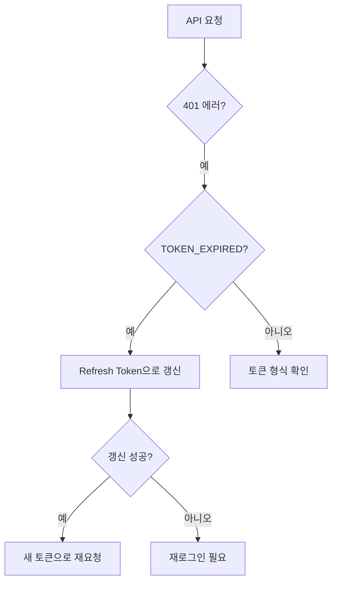

# 인증 관련 문제

> 인증과 관련된 문제를 진단하고 해결하는 방법을 안내합니다.

## 개요

회원가입, 로그인, 토큰 갱신, 소셜 로그인 등 인증 과정에서 발생하는 문제와 해결 방법을 안내합니다.

---

## 회원가입 문제

### 이메일 회원가입 실패

| 에러 | 원인 | 해결 방법 |
|------|------|---------|
| `EMAIL_ALREADY_EXISTS` | 이미 등록된 이메일 | 로그인을 시도하거나 비밀번호 재설정을 요청하세요 |
| `INVALID_EMAIL` | 올바르지 않은 이메일 형식 | 이메일 형식을 확인하세요 (예: user@example.com) |
| `WEAK_PASSWORD` | 비밀번호 규칙 미충족 | 비밀번호 규칙을 확인하세요 |

### 비밀번호 규칙

bkend의 비밀번호 규칙입니다.

| 규칙 | 요구사항 |
|------|---------|
| 최소 길이 | 8자 이상 |
| 최대 길이 | 128자 이하 |

---

## 로그인 문제

### 이메일 로그인 실패

| 에러 | 원인 | 해결 방법 |
|------|------|---------|
| `INVALID_CREDENTIALS` | 이메일 또는 비밀번호 불일치 | 입력 정보를 확인하세요 |
| `ACCOUNT_LOCKED` | 로그인 시도 횟수 초과로 잠금 | 잠시 후 다시 시도하세요 |
| `ACCOUNT_NOT_FOUND` | 존재하지 않는 계정 | 이메일 주소를 확인하거나 회원가입하세요 |
| `TOO_MANY_ATTEMPTS` | 인증 시도 횟수 초과 | 잠시 후 다시 시도하세요 |

### 로그인 디버깅

```typescript
const response = await fetch('https://api.bkend.io/auth/email/signin', {
  method: 'POST',
  headers: { 'Content-Type': 'application/json' },
  body: JSON.stringify({
    email: 'user@example.com',
    password: 'password123'
  })
});

if (!response.ok) {
  const error = await response.json();
  switch (error.code) {
    case 'INVALID_CREDENTIALS':
      console.error('이메일 또는 비밀번호가 올바르지 않습니다');
      break;
    case 'ACCOUNT_LOCKED':
      console.error('계정이 잠겼습니다. 잠시 후 다시 시도하세요');
      break;
    default:
      console.error('로그인 실패:', error.message);
  }
}
```

---

## 토큰 문제

### Access Token 만료

Access Token의 유효 기간은 **1시간**입니다.



### Refresh Token 갱신 실패

| 에러 | 원인 | 해결 방법 |
|------|------|---------|
| `REFRESH_TOKEN_EXPIRED` | Refresh Token 만료 (7일) | 재로그인이 필요합니다 |
| `REFRESH_TOKEN_REVOKED` | Refresh Token이 폐기됨 | 다른 기기에서 로그아웃 또는 보안 이벤트 발생. 재로그인하세요 |
| `REFRESH_TOKEN_REUSED` | 이미 사용된 Refresh Token | 토큰 재사용 공격 감지. 모든 세션이 종료됩니다. 재로그인하세요 |

### 자동 토큰 갱신 예시

```typescript
async function fetchWithAuth(url: string, options: RequestInit = {}) {
  let accessToken = getStoredAccessToken();

  const response = await fetch(url, {
    ...options,
    headers: {
      ...options.headers,
      'Authorization': `Bearer ${accessToken}`,
      'X-API-Key': '{your_api_key}'
    }
  });

  if (response.status === 401) {
    // 토큰 갱신 시도
    const refreshToken = getStoredRefreshToken();
    const refreshRes = await fetch('https://api.bkend.io/auth/refresh', {
      method: 'POST',
      headers: { 'Content-Type': 'application/json' },
      body: JSON.stringify({ refreshToken })
    });

    if (refreshRes.ok) {
      const { accessToken: newToken, refreshToken: newRefresh } = await refreshRes.json();
      storeTokens(newToken, newRefresh);

      // 새 토큰으로 원래 요청 재시도
      return fetch(url, {
        ...options,
        headers: {
          ...options.headers,
          'Authorization': `Bearer ${newToken}`,
          'X-API-Key': '{your_api_key}'
        }
      });
    }

    // 갱신 실패 → 재로그인
    redirectToLogin();
  }

  return response;
}
```

---

## 소셜 로그인 문제

### OAuth 콜백 실패

| 에러 | 원인 | 해결 방법 |
|------|------|---------|
| `OAUTH_STATE_MISMATCH` | state 파라미터 불일치 | 브라우저를 새로고침하고 다시 시도하세요 |
| `OAUTH_CODE_INVALID` | 인증 코드 만료 또는 재사용 | 소셜 로그인을 처음부터 다시 시도하세요 |
| `PROVIDER_ERROR` | 소셜 프로바이더 오류 | 프로바이더 상태를 확인하세요 |

### 소셜 로그인 설정 확인

| 확인 항목 | 설명 |
|----------|------|
| **Client ID** | 프로바이더에서 발급받은 Client ID |
| **Client Secret** | 프로바이더에서 발급받은 Secret |
| **Redirect URI** | bkend 콜백 URL이 프로바이더에 등록되어 있는지 |
| **스코프** | 필요한 권한 스코프가 설정되어 있는지 |

### 프로바이더별 확인사항

| 프로바이더 | 필수 스코프 | Redirect URI |
|-----------|-----------|-------------|
| Google | `openid`, `email`, `profile` | 콘솔에서 확인 |
| GitHub | `read:user`, `user:email` | 콘솔에서 확인 |

---

## 이메일 인증 문제

### 인증 이메일 미수신

| 원인 | 해결 방법 |
|------|---------|
| 스팸 폴더에 분류 | 스팸/정크 폴더를 확인하세요 |
| 이메일 주소 오타 | 등록한 이메일 주소를 확인하세요 |
| 발송 한도 초과 | 시간당 3회 제한, 잠시 후 재시도하세요 |

### 인증 코드 만료

| 상황 | 대응 |
|------|------|
| 인증 코드 만료 | 인증 이메일을 다시 발송하세요 |
| 발송 한도 초과 | 2시간 후 재시도하세요 |

---

## 비밀번호 재설정 문제

| 문제 | 해결 방법 |
|------|---------|
| 재설정 이메일 미수신 | 스팸 폴더 확인, 이메일 주소 확인 |
| 재설정 링크 만료 | 재설정 요청을 다시 보내세요 |
| 새 비밀번호 거부 | 비밀번호 규칙을 확인하세요 |

---

## 관련 문서

- [자주 발생하는 에러](01-common-errors.md) — HTTP 에러 코드별 해결
- [이메일 로그인](../authentication/04-login-email.md) — 이메일 로그인 가이드
- [JWT 토큰](../authentication/12-jwt-tokens.md) — 토큰 구조와 관리
- [토큰 갱신](../authentication/13-refresh-tokens.md) — Refresh Token 사용법
